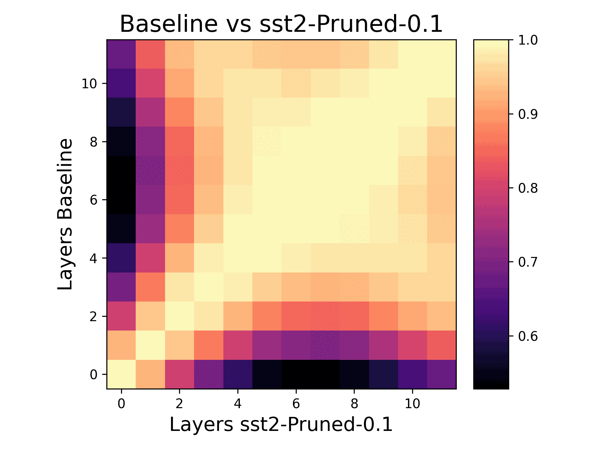

# LLMs: What Can Pruning Tell Us?

### Overview
Large Language Models (LLMs) have shown exceptional performance across various modalities such as text, vision, and audio. Like many breakthroughs in Machine Learning (ML), LLMs gained prominence through empirical findings. This naturally leads to a lack of explainability of why LLMs are able to outperform other models so comprehensively. Chief among these breakthroughs is LLM's capability to excel in multi-task learning, where the same pretrained architecture is fine tuned for different downstream tasks. The goal of this project was simple: we explored how pruning reveals structure in the feature representation of BERT. We used two different kinds of pruning: L1 (magnitude based) and Attribution Pruning [https://arxiv.org/abs/2205.04157]. We used PyTorch for our experiments and evaluated the different feature representations using accuracy and Central Kernel Alignment (CKA) [https://arxiv.org/pdf/1905.00414].

### Installation
A requirements.txt file is provided to make installing the correct versions of python packages simple. Python 3.10.12 was used across the entire project. Note that we used a fork of the torch_cka package to enable it work with Bert's inputs. This variant of torch-cka is tracked as PyTorch-Model-Compare and needs to be installed with: `pip install -e PyTorch-Model-Compare/` (assuming your are in the project's root directory).

### Results
An example of the results can be found here. The output of torch_cka is a heatmap comparing the feature representation of the same layers in the baseline and pruned encoder. Higher values (brighter) correspond to more similarity. The gif below shows how pruning evolves the feature representation over time.

### Writeup
The writeup and analysis of the experiments and results can be found [here](./media/llm_report.pdf). Alternatively, the [powerpoint](./media/LLM_Pruning_Report.pptx) provides a high level summary.

### Developers
Andrew Kettle (Lead)   https://github.com/Akettle44  
Abhinand Ganesh        https://github.com/AbhinandG  
Brianna Gautama        https://github.com/briannagautama  
Diya Saha              https://github.com/DiyadotSaha  
