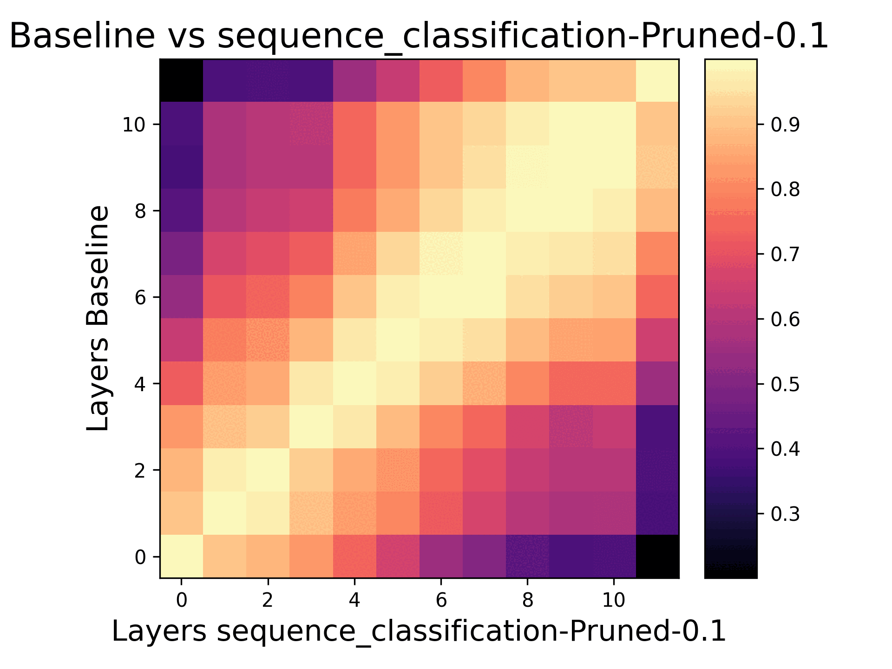
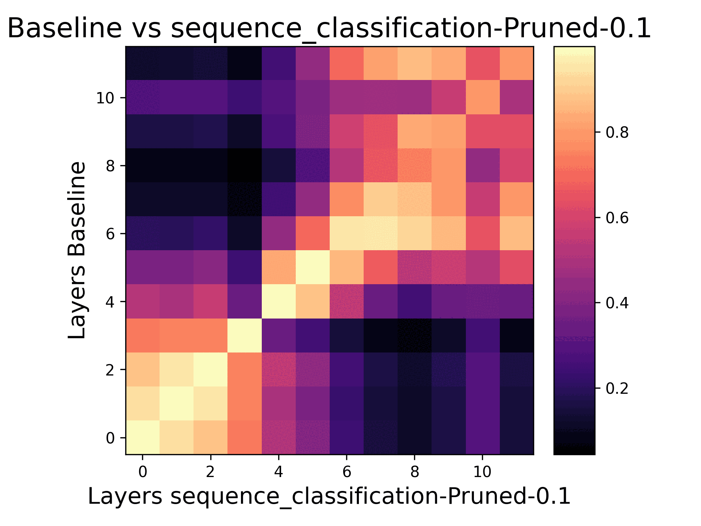

# LLMs: What Can Pruning Tell Us?

### Overview
Large Language Models (LLMs) have shown exceptional performance across various modalities such as text, vision, and audio. Like many breakthroughs in Machine Learning (ML), LLMs gained prominence through empirical findings. This naturally leads to a lack of explainability of why LLMs are able to outperform other models so comprehensively. Chief among these breakthroughs is LLM's capability to excel in multi-task learning, where the same pretrained architecture is fine tuned for different downstream tasks. The goal of this project was simple: we explored how pruning reveals structure in the feature representation of BERT. We chose BERT because it is quick to iterate and train with limited compute, even though it might not be considered an LLM by 2024's standards :). We used two different kinds of pruning: L1 (magnitude based) and Attribution Pruning [https://arxiv.org/abs/2205.04157]. We used PyTorch for our experiments and evaluated the different feature representations using accuracy and Central Kernel Alignment (CKA) [https://arxiv.org/pdf/1905.00414].

### Installation
A requirements.txt file is provided to make installing the correct versions of python packages simple. Python 3.10.12 was used across the entire project. Note that we used a fork of the torch_cka package to enable it work with Bert's inputs. This variant of torch-cka is tracked as PyTorch-Model-Compare and needs to be installed with: `pip install -e PyTorch-Model-Compare/` (assuming your are in the project's root directory).

### Results
It is well understood in deep learning that earlier layers of deep models correspond to simpler features, and features become progressively more abstract with network depth. In vision, CNNs lower layers contain edges and corners that evolve into more abstract features deeper in the CNN. These early features are simple but also extremely general. Most objects have corners and edges, so they serve as an intuitive starting point to build more complex features that are specific to the task later in the network. Language exhibits similar trends, early layers are responsible for general sentence or word semantics, and deeper layers are capable of more complex tasks, such as understanding sentiment. 

The output of our experiments are heatmaps comparing the feature representation of the same layers in the baseline and pruned encoder. Higher values (brighter) correspond to more similarity. The gifs below shows how pruning evolves the feature representation over time, the left gif corresponds to SST and the right gif corresponds to COLA. We can see that lower depth features, those that are responsible for general language semantics, survive longer than deeper features that are typically task specific. This result is interesting because it suggests two things: 1. The deeper layers rely on earlier layers as building blocks and 2. pruning can be seen to have a regularizing effect where removing neurons forces the model to become less expressive (fall back on simpler features). 

### Active Developers
Andrew Kettle (Lead, Refactor)   https://github.com/Akettle44

### Version 1 Developers
Abhinand Ganesh        https://github.com/AbhinandG  
Brianna Gautama        https://github.com/briannagautama  
Diya Saha              https://github.com/DiyadotSaha  
